# Voith's CODE Plugins for MysticThumbs

Plugin development for MysticThumbs - The SVG-, FFMpeg and DLL plugins

Last updated: February 26th, 2026

 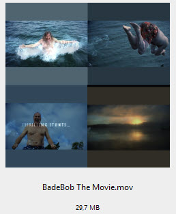 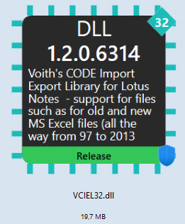

*Examples of SVG, FFMPeg and DLL thumbnails!*

# About MysticThumbs

MysticThumbs is a very powerful Windows thumbnail extension framework developed by MysticCoder (<https://www.mysticcoder.net>).

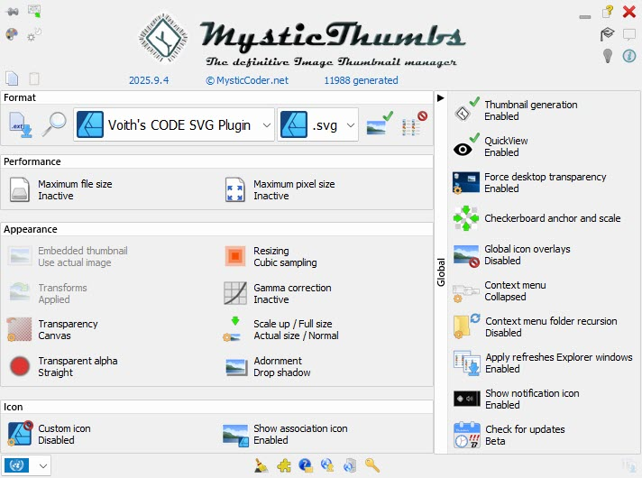

MysticThumbs extends Windows Explorer with support for file types not handled natively by Windows.

MysticThumbs also supports third-party plugin development via .mtp plugin DLLs. This is what this README is all about.

This repository currently contains three plugins:

- VCSVGPlugin32/64.mtp
- VCFFMpegPlugin32/64.mtp
- VCDLLPlugin32/64.mtp

This guide will first step through the building of the DLL plugin, since that plugin is completely self-standing, meaning that it does not depend on other libraries such as resvg or ffmpeg.

# Architecture Overview

MysticThumbs itself consists of the following components:

- `MysticThumbs.exe` – Resident watchdog / QuickView

- `MysticThumbsControlPanel.exe` – The Control Panel application

- `MysticThumbs32.dll / MysticThumbs64.dll` – Windows shell extension DLL

- Your plugin: `YourPluginNN.mtp`, such as for example `VCSVGPlugin64.mtp`

The .mtp file is simply a renamed DLL.

The Windows Explorer process loads:

`Explorer.exe`

​	`└── MysticThumbsNN.dll`

​		`└── YourPluginNN.mtp`

⚠️ Your plugin runs inside Explorer or any other host displaying windows thumbnails. This may for example be applications such as Directory Opus, Listary, Everything Search and more.

Stability, memory safety and exception safety are critical.

## Plugin Development Strategy

The foundation is the official ExamplePlugin from MysticCoder:

<https://mysticcoder.net/MysticThumbsPlugins/>

The ExamplePlugin-project example defines the architectural expectations:

- Implement IMysticThumbsPlugin

- No global state corruption

- Fail gracefully

- Never throw exceptions across boundaries

- Avoid CRT mismatches

- Be thread-safe

- Return clean HRESULTs

The ExamplePlugin-project should be regarded as the "best practices" for implementing your own plugins. Also note that the ExamplePlugin-project contain the main interface header file, the `MysticThumbsPlugin.h`.

These plugins in this repo are written to closely follow the philosophy of ExamplePlugin.

# DLL Plugin


This is the simplest in overall concept and should be the easiest plugin to build. You should be able to load the Visual Studio solution file (.sln) in Visual Studio, select Configuration (Debug or Release) and Platform (x64 or x86) and build!

This plugin generates thumbnails for:

- .dll

- .ocx

- .mtp (MysticThumb plugins themselves)

Strategies include:

- Extracting version info. My primary use is to quickly see the version of the DLL.

- Generating synthetic graphic, attempt to look like a chip

- Overlaying metadata text, can be controlled by semi-HTML and variables

- Debug, Release or Test visualization by using banner

- Code signed visualization, both embedded code certificates and catalog certificates are supported.

### DLL Plugin Registry Configuration

All registry settings are within MysticThumbs control. That means that the DLL settings are all located here in Windows Registry:

`HKEY_CURRENT_USER\Software\MysticCoder\MysticThumbs\File Formats\Voith's CODE DLL Plugin\Settings`

Below you see the registry content above:

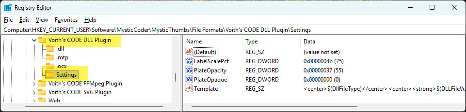

Note that the subkey also contain `.dll, .mtp` and `.ocx` settings. These are the settings used by MysticThumbs itself. The settings that the DLL plugin itself controls, are all located in the `Settings`-key.

Highlights from SVG plugin's own settings:

* **LabelScalePct**. How large should the label itself be in percent
* **PlateOpaque**. Turn on or off whether the plaque should be opaque or not.
* **PlateOpacity**. If turned on, how opaque should the plaque bee? In percent.
* **Template**. This is where you control what to see on the plaque! Looking at the example at the header of DLL plugin, it uses the default setting:
	
	```
	<center>$(DllFileType)</center>
	<center><strong>$(DLLFileVersionAsText)</strong></center>
  <tiny>$(VI_FileDescriptionFirstSentence)</tiny>
	```
	
  This is super-powerful and you can use the following variables. The prefix "VI_" means that the variable comes from the VERSIONINFO-block in the file:
  
  * **DllFileType**. This will be "MTP", "DLL" or "OCX"
  * **DLLFileVersionAsText**, a textual version of the FileVersion, such as "1.2.0.510". It says "(no file version)" if not found.
  * **DLLBitnessAsText**, this will be "32-bit", "64-bit", "ARM64", "ARM" or "Unknown"
  * **VI_CompanyName**
  * **VI_FileDescription**. Note that you can also use the VI_FileDescriptionFirstSentence to extract just first sentence
  * **VI_FileVersion**
  * **VI_InternalName**
  * **VI_LegalCopyright**
  * **VI_OriginalFilename**
  * **VI_ProductName**
  * **VI_ProductVersion**
  * **VI_Comments**
  * **VI_LegalTrademarks**
  * **VI_PrivateBuild**
  * **VI_SpecialBuild**
  * **VI_FileDescriptionFirstSentence**. Only extract the first sentence from VI_FileDescription
  
  As you also see from the template content, you have some slight visual control too, where you can use these semi-HTML like tags to sculpt the text. Note that NO OTHER HTML is allowed (or more precise, will work)
  
  * **center** - Will center the text in the plaque. The default is leftified text.
  * **strong** - Will make the text bold
  * **small** - will make the text a little smaller
  * **tiny** - will make the text even smaller
  
  

# SVG Plugin


I noticed that the built-in support for SVG-rendering in MysticThumbs didn't quite work for my taste. I have huge collections of SVG files and needed especially the transparency to be controlled. 

I therefore decided to start with my own SVG plugin for MysticThumbs. 

Early versions of my plugin used only Direct2D. That approach quickly failed on many SVG constructs. I therefore decided to allow my SVG plugin to use an external "Thumbnailer", meaning the ability to call any other external tool and let that produce the thumbnail for me. One super candidate for such an external thumbnailer is **Inkscape** (https://inkscape.org). It is extremely powerful and fits beautifully within this concept.

So, if Direct2D rendering failed (which it did quite often, like "almost allways"!), my plugin would fallback to use Inkscape client to render the thumbnail for me. 

However, calling an external process like this, also comes with a price. The generation of SVG-thumbnails suddenly took around 1-2 seconds per thumbnail.

What about building the rendering from for example Inkscape into the plugin? While it is possible to do that with Inkscape, my search also hit **resvg** (https://github.com/linebender/resvg). It turned out to be a super candidate!

resvg is:

- Written in Rust

- Extremely fast

- Spec-accurate. So far I haven't stumbled upon any svg that won't play with the plugin.

- Offers a C API

- And event suitable for static linking!


### LICENSE

*This product includes software developed by the resvg project (https://github.com/linebender/resvg), licensed under the Mozilla Public License 2.0, as required by the LGPL.*

Please see all relevant license files in the `.\ThirdPartyLicenses`.


## The SVG plugin replaces the standard support for SVG rendering in MysticThumbs

One thing to have clear already now, is that MysticThumbs by default do have support for svg and svgz rendering. 

The plugin-architecture of MysticThumbs was first and foremost designed to allow developers to create plugins rendering *unsupported* or *new* file formats in MysticThumbs. The SVG plugin project will *replace* the existing SVG-rendering of the *Scalable Vector Graphics*-format. Below you see how that looks in MysticThumbs (choose format from the drop-down list of formats):


In the screenshot above you see how the .svg file extension is handled by the Scalable Vector Graphics-format. Clicking on the file extension drop-down list reveal that this format also handles the compressed .svgz files:


Note the eclipsis (...) at the bottom! This is where you can add more file extensions to a format, or - in our case - remove the extensions from the Scalable Vector Graphics-format. 

*In other words: We remove the file .svg and .svgz extensions from the Scalable Vector Graphics-format*

Click on the eclipsis line to bring up the following dialog box:

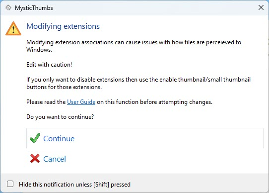

This brings up the following dialog box:

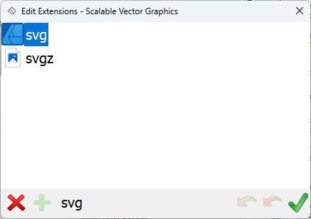

In the dialog box above, we can now click on each file extension and press the red cross-button in the lower left corner to remove it. Repeat for svgz. Press the Apply button (green check mark in the lower right corner) to save. 

Below you see how the *Scalable Vector Graphics*-format look like when it don't handle any formats anymore:

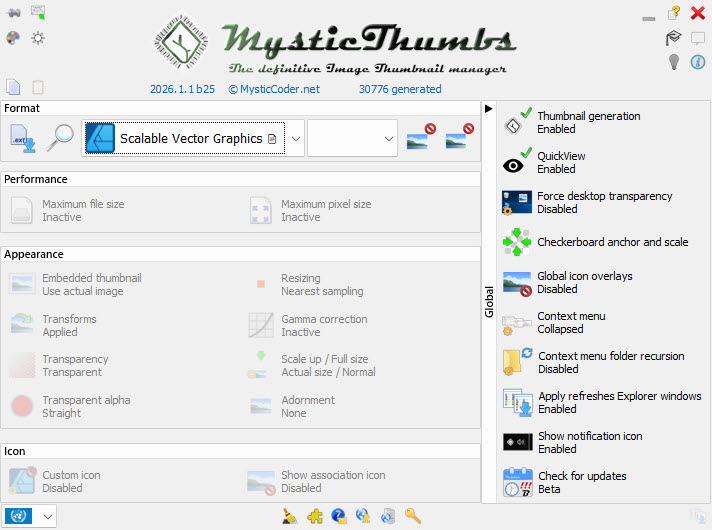

Now you are ready to continue to build the SVG plugin.

## Static resvg Integration (No DLL Shipping)

resvg is built as a fully static MSVC-compatible library:

- Rust target: x86_64-pc-windows-msvc

- Rust flags: -C target-feature=+crt-static

- Plugin runtime: /MT

## How to download and build resvg

### Requirements

-   Windows 10/11
-   Visual Studio 2022 (Desktop development with C++)
    -   MSVC v143
    -   Windows 10/11 SDK
    -   Visual Studio 2026 should also work!
-   x64 Native Tools Command Prompt for VS 2022 (these command prompts installs with VS2022)
-   x86 Native Tools Command Prompt for VS 2022

### Steps to download and install resvg

The SVG plugin uses **resvg** via its C API, built as a static MSVC-compatible library.

Before you start, you should have a strategy where you want to store external libraries. For example your projects could live in `D:\Dev\VS20xx\Projects`, and the toolkits in `D:\Dev\Toolkits`. The Visual Studio .vcxproj file would need to know the whereabouts of the headers and library files of resvg when building.

On my machine the include libraries for resvg live here:

`D:\Dev\Toolkits\resvg-capi\x86\include\`
`D:\Dev\Toolkits\resvg-capi\x64\include\`

... and the libraries for resvg live here:

`D:\Dev\Toolkits\resvg-capi\x86\lib`
`D:\Dev\Toolkits\resvg-capi\x64\lib`

#### 1. Install Rust (MSVC toolchain)

Download `rustup‑init.exe` from: https://rustup.rs/

Then:

    rustup default stable
    rustup target add x86_64-pc-windows-msvc
    rustup target add i686-pc-windows-msvc

#### 2. Install cargo-c

    cargo install cargo-c
    cargo cinstall --version

#### 3. Clone resvg

Note that this will be the Rust-source directory for resvg.Remember, this is different from the resvg C API library which we will build soon

    cd /d D:\Dev\Rust
    git clone https://github.com/linebender/resvg.git
    cd resvg

#### 4. Build static C API (x64)

Open *x64 Native Tools Command Prompt* and now we will build the C API. Note the different placement versus the Rust-repo above.

    set PREFIX=D:\Dev\Toolkits\resvg-capi\x64
    set RUSTFLAGS=-C target-feature=+crt-static
    
    cargo cinstall --release --locked ^
      --manifest-path crates/c-api/Cargo.toml ^
      --target x86_64-pc-windows-msvc ^
      --prefix %PREFIX%

#### 5. Build static C API (Win32)

Open *x86 Native Tools Command Prompt*:

    set PREFIX=D:\Dev\Toolkits\resvg-capi\x86
    set RUSTFLAGS=-C target-feature=+crt-static
    
    cargo cinstall --release --locked ^
      --manifest-path crates/c-api/Cargo.toml ^
      --target i686-pc-windows-msvc ^
      --prefix %PREFIX%

#### 6. Visual Studio integration

In order to let your project use the resvg C API files, the .vcxproj file needs to know about the whereabouts of these files. Below are the settings

- General settings
  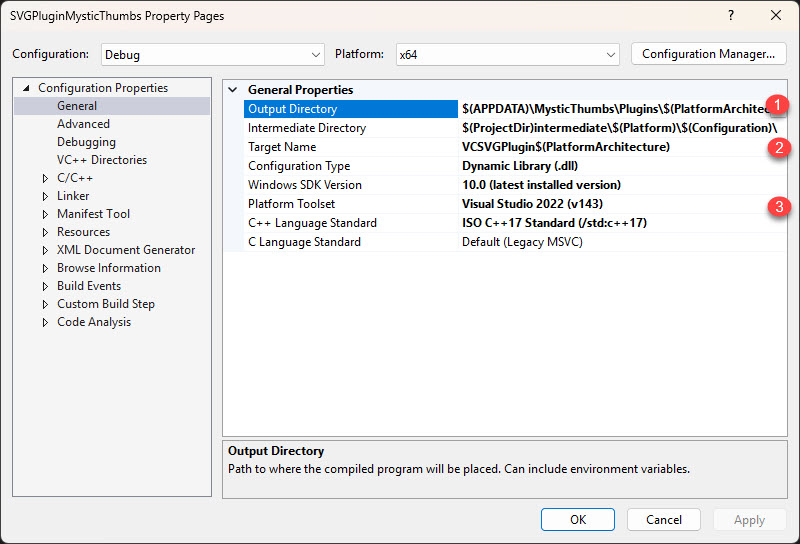
  Note how the projects Output directory (marked by 1 above) automatically places the result in the MysticThumbs plugins directory. The macros ensure that the platform (32 or 64) is used both in directory naming and for Target Name (marked by 2). My plugin uses C++ version 17, as marked by 3.

- Ensure SVGPLUG_EXPORTS is used
  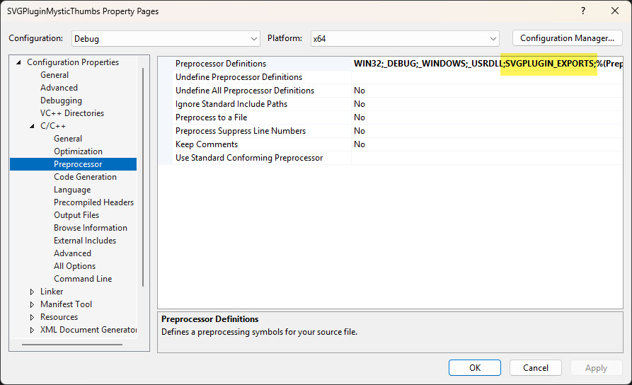

- Runtime Library: Mutil Thread **/MT** and **/MTd**
  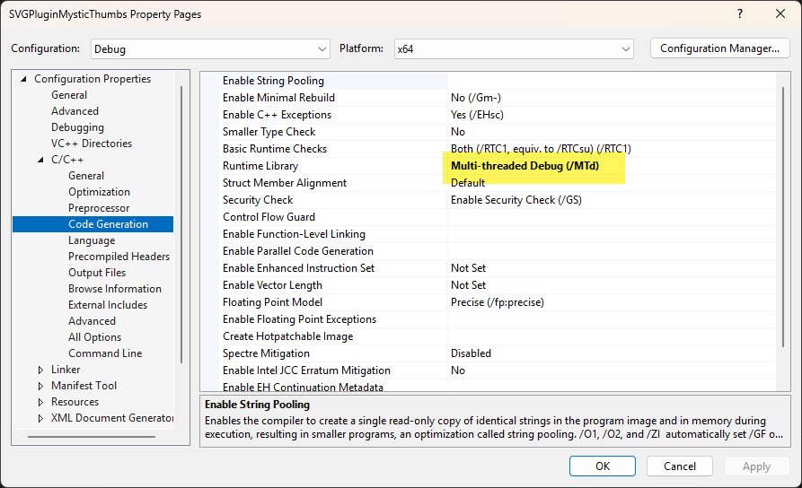

- Include directories:
  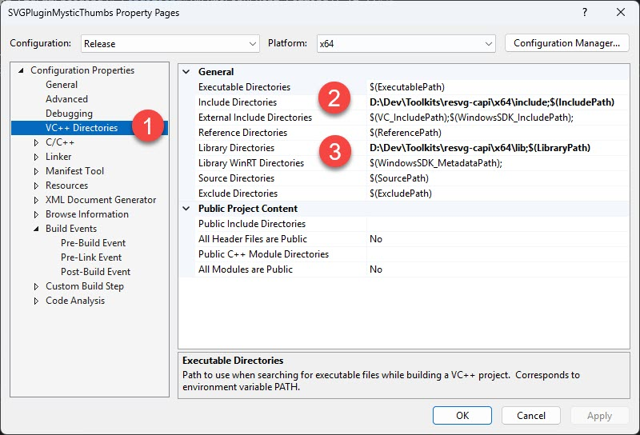
  Above you see the settings for x64 builds

  - x64:

    ```
    D:\Dev\Toolkits\resvg-capi\x64\include
    ```

  - x86:

    ```
    D:\Dev\Toolkits\resvg-capi\x86\include
    ```

- Library directories:

    - x64:

    	```
    	D:\Dev\Toolkits\resvg-capi\x64\lib
    	```

    - x86:

    	```
    	D:\Dev\Toolkits\resvg-capi\x86\lib
    	```

- Additional dependencies:
  Note that the source code explicitly links all necessary libraries with the use of `#pragma` in the code, like this:
  `#pragma comment(lib, "resvg.lib")`. 
  
- Build the project - and verify
  Build the project and use dumpbin.exe on the outout file, like this:
	
  ```
    dumpbin /dependents VCSVGPlugin64.mtp
  ```
  Below you see a normal /dependents dump from my 64-bit .mtp file:
  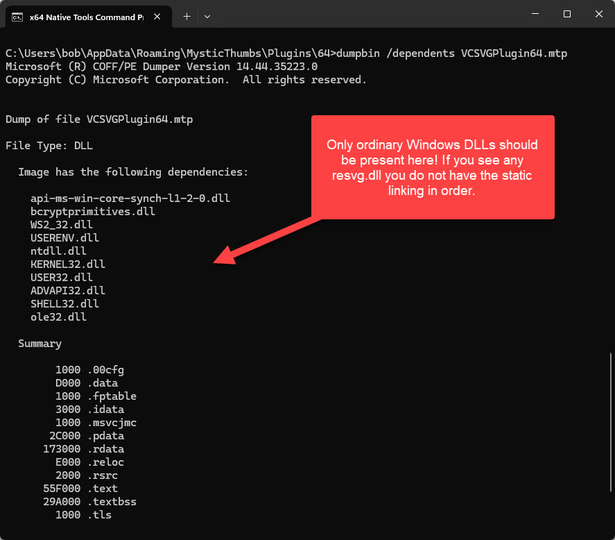 

### Result

Your final plugin:

- Requires no resvg.dll

- Requires no vcruntime\*.dll

- Is fully self-contained

### SVG Rendering Strategy

The main processing of thumbnail generation is done via the Ping- and Generate methods. Below is how the SVG thumbnail is rendered during Generate():

1.  Receive IStream from MysticThumbs

2.  Extract filename via STATSTG

3.  Compute CRC32 for logging

4.  Write to temp SVG. Remember, SVG is plain text behind the scenes.

5.  Optional normalization. Since SVG is plain text, we can do certain normalization before actual rendering.

6.  Render via resvg C API

7.  If failure → external thumbnailer fallback

8.  Return 32-bit RGBA bitmap


### SVG Plugin Registry Configuration

All registry settings are within MysticThumbs control. That means that the SVG settings are all located here in Windows Registry:

`HKEY_CURRENT_USER\Software\MysticCoder\MysticThumbs\File Formats\Voith's CODE SVG Plugin\Settings`

Below you see the registry content above:

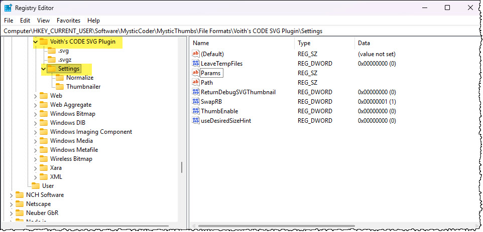

Note that the subkey also contain `.svg` and `.svgz` settings. These are the settings used by MysticThumbs itself. The settings that the SVG plugin itself controls, are all located in the `Settings`-key.

Highlights from SVG plugin's own settings:

* **LeaveTempFiles**. Remember that SVG is plain text files. Since the SVG plugin can normalize some aspects of the SVG file itself, simply by modifying the text, it can be useful to store the temporary files for debugging purposes.
  0 = Temporary SVG/PNG files are deleted (default)
  1 = `Temporary files are preserved for debugging

* **SwapRB**. Controls pixel channel swapping after internal SVG rendering.
  0 = Do not swap red/blue channels
  1 = Swap red/blue channels (default)
  Why does this exist?  The internal renderer (`resvg`) produces images in **RGBA** format, while Windows thumbnail pipelines often interpret pixel buffers as **BGRA**.
   When enabled, this option corrects color channel ordering so thumbnails appear with correct colors.

* **ReturnDebugSVGThumbnail**. Forces the plugin to return a synthetic debug thumbnail instead of rendering the actual SVG content.
  0 = Normal operation (default)
  1 = Always return a debug SVG thumbnail
  When enabled, the plugin bypasses all SVG processing (normalization, internal rendering, and external thumbnailers) and instead returns a small, programmatically generated test image. The debug thumbnail is intentionally simple and visually distinctive (magenta background with a diagional line). This makes it immediately obvious that the plugin was successfully loaded, Generate() was actually invoked, the returned pixel buffer was accepted by MysticThumbs / Explorer.

  This option is extremely useful when diagnosing issues such as:

  * the plugin not being selected for a file type, thumbnail generation silently falling back to another provider
  * unexpected failures in the rendering pipeline, thread-related or reentrancy issues.

* **LogIncludeCRC**. Should the log contain a CRC32 value for each log line. Makes it easier to identify the file in question.
  0 = no CRC/call-id prefix
  1 = include prefixes (default)

* **UseDesiredSizeHint**. Controls whether the plugin respects the `desiredSize` hint provided by MysticThumbs.
  0 = Ignore the size hint and render using internal scaling logic (default)
  1 = espect the `desiredSize` hint when rendering thumbnails

* **MaxSvgDim**. Defines a hard upper limit for the rendered SVG width or height, in pixels.
  Any positive integer = Maximum allowed SVG dimension
  0 = No explicit dimension limit (not recommended)
  This setting caps the maximum width *or* height that an SVG may be rendered at, regardless of its intrinsic size or the requested thumbnail size.

  It protects against SVG files with extremely large viewboxes or pathological dimensions that could otherwise lead to excessive rendering cost or memory allocation.

  If the computed render size exceeds this value, rendering is aborted and the plugin falls back to the external thumbnailer (if configured).

  Default value is 4096

* **MaxSvgBytes**. Defines a maximum allowed memory consumption for a single SVG render operation.
  Positive integer = Maximum allowed bytes allocated for rendering
  0 = No memory limit (not recommended)
  This setting enforces an absolute cap on the number of bytes the plugin is allowed to allocate for rendering an SVG thumbnail.

  It acts as a final safety guard against:

  - malicious SVG files,
  - accidental memory blowups,
  - extreme scaling factors.

  If the estimated memory usage (`width × height × 4 bytes`) exceeds this value, the internal renderer is skipped and the plugin attempts to use the external thumbnailer instead.

  Default value is 256 * 1024 * 1024 

  

An important note regarding MaxSvgDim and MaxSvgBytes: MysticThumbs itself also has similar protection settings.

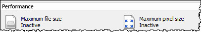

Keep the defaults and you should be pretty safe, or turn off the settings in the plugin and activate them in MysticThumbs itself as shown above.

The SVG plugin contain some extra keys too, `Normalize` and `Thumbnailer`. First up is the Normalize.

#### Normalize

`HKEY_CURRENT_USER\Software\MysticCoder\MysticThumbs\File Formats\Voith's CODE SVG Plugin\Settings\Normalize`

This section controls optional SVG normalization steps applied **before rendering**. Normalization is useful for fixing SVG files that rely on constructs that confuse thumbnail renderers.

* **RootFillWhite**. Removes `fill="white"` from the root `<svg>` element.
  0 = Do not modify root fill
  1 = Remove `fill="white"` from `<svg>` (default)
  This is particularly important for icon-style SVGs where a white root fill can make shapes invisible on a white background.
* **RgbaAttributes**. Enable normalization of `fill="rgba(...)"` attributes.
  0 = Disabled (default)
  1 = Enabled
* **RgbaStyle**. Enable normalization of `rgba(...)` values inside `style=` attributes.
  0 = Disabled (default)
  1 = Enabled

Note: The internal `resvg` renderer is generally tolerant of modern SVG color syntax, so these options are disabled by default and intended for edge cases only.

#### Thumbnailer

`HKEY_CURRENT_USER\Software\MysticCoder\MysticThumbs\File Formats\Voith's CODE SVG Plugin\Settings\Thumbnailer`

This section defines an **external fallback thumbnail renderer**. It is used only if the internal `resvg` renderer fails.

* **Path**. Full path to the external thumbnailer executable.

  Examples:

  ```
  C:\Program Files\Inkscape\bin\inkscape.exe
  D:\Tools\resvg.exe
  ```

  ------

* **Params**. Command-line parameters passed to the external thumbnailer. The string may contain **placeholders** that are expanded at runtime:

  * `$(SourceFile)` - Full path to the temporary SVG file

  * `$(TargetFile)` - Full path where the PNG output should be written

  * `$(DesiredSize)` - Requested thumbnail size (pixels)

  * `$(TempDir)` - Temporary working directory

    Examples:
    Inkscape: `"$(SourceFile)" --export-type=png --export-filename="$(TargetFile)" --export-background-opacity=0`
    resvg CLI: `"$(SourceFile)" "$(TargetFile)"`

# FFMpeg Plugin 


FFMpeg (https://www.ffmpeg.org) is an extremely powerful set of tools to work with video and audio files. The FFMPeg plugin will render the following video file types: mp4, m4v, mov, mkv, avi, wmv, flv, webm, mpg, mpeg,ts, m2ts and mts! It could also be set up to render different audio file types such as: mp3, aac, m4a, flac, ogg and wav. 

Windows struggles with:

- AV1

- Web-encoded MP4

- Certain H264 variants

The FFMpeg plugin do not use ffmpeg staticly The plugin uses:

- FFmpeg DLLs

- Built via vcpkg

- With dav1d support for AV1

As you soon will see, the ffmpeg library and its dlls are build via the vcpkg-package manager. The ffmpeg library can be created with all kind of support for advanced codecs like x264 and x265. The only extra codec the FFMpeg plugin uses are the dav1a-codec. 

### LICENSE

*This product includes FFmpeg libraries (https://ffmpeg.org) licensed under the GNU Lesser General Public License v2.1 (LGPLv2.1).*

The FFmpeg libraries are dynamically linked and distributed as separate DLL files. In accordance with the LGPL, users are permitted to replace the included FFmpeg DLLs with their own compatible builds.

Please see all relevant license files in the `.\ThirdPartyLicenses` directory.

## How to download and build ffmpeg

### Requirements

-   Windows 10/11
-   Visual Studio 2022 (Desktop development with C++)
    -   MSVC v143
    -   Windows 10/11 SDK
    -   Visual Studio 2026 should also work!
-   x64 Native Tools Command Prompt for VS 2022 (these command prompts installs with VS2022)
-   x86 Native Tools Command Prompt for VS 2022

### 1. Install vcpkg

vcpkg (https://vcpkg.io/en/) is a package manager making it relatively easy to install all sorts of packages and have them built according to your needs. 

    cd /d D:\Dev
    git clone https://github.com/microsoft/vcpkg.git
    cd vcpkg
    bootstrap-vcpkg.bat
    vcpkg integrate install

### 2. Install FFmpeg with dav1d

This step build the ffmpeg library and dlls according to the specification. 

#### x64:

    vcpkg remove ffmpeg:x64-windows
    vcpkg install "ffmpeg[dav1d]:x64-windows"

#### Win32:

Note that the x86-build with dav1d-codec is on an experimental level, thus the `--allow-unsupported` flag

    vcpkg remove ffmpeg:x86-windows
    vcpkg install "ffmpeg[dav1d]:x86-windows" --allow-unsupported

### 3. Visual Studio integration

Just like the resvg-integration in the SVG plugin project, the FFMpeg plugin project must also know where you have stored the ffmpeg-library. Since we are using vcpkg to download and build the files, the include- and library directories below, reference the general vcpkg-directories

##### Include directories:

```
D:\Dev\vcpkg\installed\x64-windows\include
```

##### Library directories:

```
D:\Dev\vcpkg\installed\x64-windows\lib
```

### 4. Build FFMpeg Plugin

Now that the FFMpeg plugin project knows about the ffmpeg library whereabouts, it should be able to build the project successfully. 

One note, there is no point in doing a `dumpbin /dependents VCFFMpegPlugin64.mtp`, since all the ffmpeg dlls are loaded dynamically during FFMpeg plugin processing.

### Ensure the ffmpeg dlls are placed in the same directory as the .mtp file

MysticThumbs has a smart way of separating the 32- and 64-bit DLLs. By having a separate 32- and 64- directory in the plugins directory, MysticThumbs and it's Windows thumbnail extension DLL MysticThumbs32.dll and MysticThumbs64.dll can reference the correct bitness. Here is what it looks like in the `%APPDATA%\MysticThumbs\Plugins` (yes, copy the directory to *your* file explorer to see *your* plugins directory)

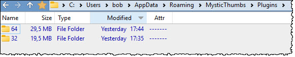

 Note the two directories, 32 and 64. If we take a peak into the 64-directory after all three plugins has been built, it looks like this:

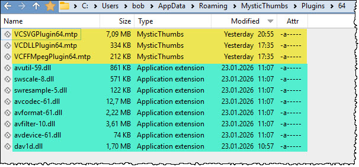

Here you see three .mtp plugins alongside the 64-bit dlls from ffmpeg project that we created previously. I have highlighted the .mtp files yellow, and all the ffmpeg dlls green.

### FFMpeg Plugin Registry Configuration

All registry settings are within MysticThumbs control. That means that the FFMpeg settings are all located here in Windows Registry:

`HKEY_CURRENT_USER\Software\MysticCoder\MysticThumbs\File Formats\Voith's CODE FFMpeg Plugin\Settings`

Below you see the registry content above:

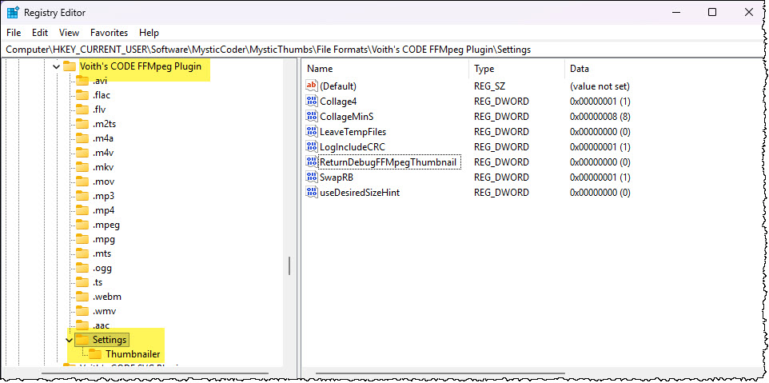

Note that the subkey also contain `.avi, .flac, .flv` and a whole sleeve of other file extension settings. These are the settings used by MysticThumbs itself. The settings that the FFMpeg plugin itself controls, are all located in the `Settings`-key.

Highlights from FFMPEG plugin's own settings:

* **Collage4**. By default the FFMpeg plugin will grab the first frame of the video and use that as thumbnail. A much more pleasing thumbnail is a small collage of video-frames grabbed as 2%, 25%, 50% and 75% of the video, giving you a better understanding of what the video contains.
  0 = Use only the first frame (default)
  1 = Use a small 2 by 2 collage of the video frames

* **CollageMinS**. If you choose to use Collage4 above, you can also set a minimum video-length in seconds before the collage is created. If a video is only 2 seconds long, it doesn't really matter to extract video-frames 2%, 25%, 50% and 75% into the video. Note that this might now be 100% precise.
  Default is 8 seconds.

* **LeaveTempFiles**. It can be useful to store the temporary files for debugging purposes.
  0 = Temporary original file saved as .tempv and PNG files are deleted (default)
  1 = `Temporary files are preserved for debugging

* **SwapRB**. Controls pixel channel swapping after internal rendering.
  0 = Do not swap red/blue channels
  1 = Swap red/blue channels (default)
  Why does this exist?  The ffmpeg renderer produces images in **RGBA** format, while Windows thumbnail pipelines often interpret pixel buffers as **BGRA**.
   When enabled, this option corrects color channel ordering so thumbnails appear with correct colors.

* **ReturnDebugFFMpegThumbnail**. Forces the plugin to return a synthetic debug thumbnail instead of rendering the actual content.
  0 = Normal operation (default)
  1 = Always return a debug thumbnail
  When enabled, the plugin bypasses all FFMpeg processing and instead returns a small, programmatically generated test image. The debug thumbnail is intentionally simple and visually distinctive (magenta background with a diagional line). This makes it immediately obvious that the plugin was successfully loaded, Generate() was actually invoked, the returned pixel buffer was accepted by MysticThumbs / Explorer.

  This option is extremely useful when diagnosing issues such as:

  * the plugin not being selected for a file type, thumbnail generation silently falling back to another provider
  * unexpected failures in the rendering pipeline, thread-related or reentrancy issues.

* **LogIncludeCRC**. Should the log contain a CRC32 value for each log line. Makes it easier to identify the file in question.
  0 = no CRC/call-id prefix
  1 = include prefixes (default)

* **UseDesiredSizeHint**. Controls whether the plugin respects the `desiredSize` hint provided by MysticThumbs.
  0 = Ignore the size hint and render using internal scaling logic (default)
  1 = espect the `desiredSize` hint when rendering thumbnails

* **MaxFFMpegDim**. Defines a hard upper limit for the rendered FFMpeg-thumbnail width or height, in pixels.
  Any positive integer = Maximum allowed thumbnail dimension
  0 = No explicit dimension limit (not recommended)
  This setting caps the maximum width *or* height that a thumbnail may be rendered at, regardless of its intrinsic size or the requested thumbnail size.

  It protects against thumbnail files with extremely large dimensions that could otherwise lead to excessive rendering cost or memory allocation.

  If the computed render size exceeds this value, rendering is aborted and the plugin falls back to the external thumbnailer (if configured).

  Default value is 4096

* **MaxFFMpegBytes**. Defines a maximum allowed memory consumption for a single ffmpeg-render operation.
  Positive integer = Maximum allowed bytes allocated for rendering
  0 = No memory limit (not recommended)
  This setting enforces an absolute cap on the number of bytes the plugin is allowed to allocate for rendering a thumbnail.

  It acts as a final safety guard against:

  - (too) huge files,
  - accidental memory blowups,
  - extreme scaling factors.

  If the estimated memory usage (`width × height × 4 bytes`) exceeds this value, the internal renderer is skipped and the plugin attempts to use the external thumbnailer instead.

  Default value is 256 * 1024 * 1024 

  

An important note regarding MaxFFMpegDim and MaxFFMpegBytes: MysticThumbs itself also has similar protection settings.


Keep the defaults and you should be pretty safe, or turn off the settings in the plugin and activate them in MysticThumbs itself as shown above.

The FFMpeg plugin contain the `Thumbnailer` subkey too: 

#### Thumbnailer

`HKEY_CURRENT_USER\Software\MysticCoder\MysticThumbs\File Formats\Voith's CODE FFMpeg Plugin\Settings\Thumbnailer`

This section defines an **external fallback thumbnail renderer**. It is used only if the ffmpeg renderer fails.

* **Path**. Full path to the external thumbnailer executable.

  Examples:

  ```
  C:\Program Files\Inkscape\bin\inkscape.exe
  D:\Tools\resvg.exe
  ```

  ------

* **Params**. Command-line parameters passed to the external thumbnailer. The string may contain **placeholders** that are expanded at runtime:

  * `$(SourceFile)` - Full path to the temporary SVG file

  * `$(TargetFile)` - Full path where the PNG output should be written

  * `$(DesiredSize)` - Requested thumbnail size (pixels)

  * `$(TempDir)` - Temporary working directory

    Examples:
    Inkscape: `"$(SourceFile)" --export-type=png --export-filename="$(TargetFile)" --export-background-opacity=0`
    resvg CLI: `"$(SourceFile)" "$(TargetFile)"`

### Important FFMpeg Design Notes

- Uses FFmpeg decoding pipeline

- Extracts representative frame

- Converts to BGRA

- Returns via MysticThumbs API

⚠️ Dealing with FFMpeg, the code must carefully manage:

- AVFormatContext

- AVCodecContext

- AVFrame

- Memory lifetime

All cleanup paths must execute — even on failure.

# Logging & CRC Strategy

All plugins may share logging via MysticThumbs logging support. When enabled, a mysticthumbs.log will be created in the `%LOCALAPPDATA%\MysticThumbs`-directory. Note that there may be many processes (explorer.exe and others) creating thumbnails at the same time. Thus, it may be difficult to group together actions belonging to a specific file. For example, the SVGZ file Ghostscript_Tiger.svg has a CRC32 value of CB63A406. By using an editor which highlights , such as 010 Editor (https://www.sweetscape.com/010editor/), you can quickly see and group together lines belonging to a specific file. Below you see how each CRC32-code is highlighted:

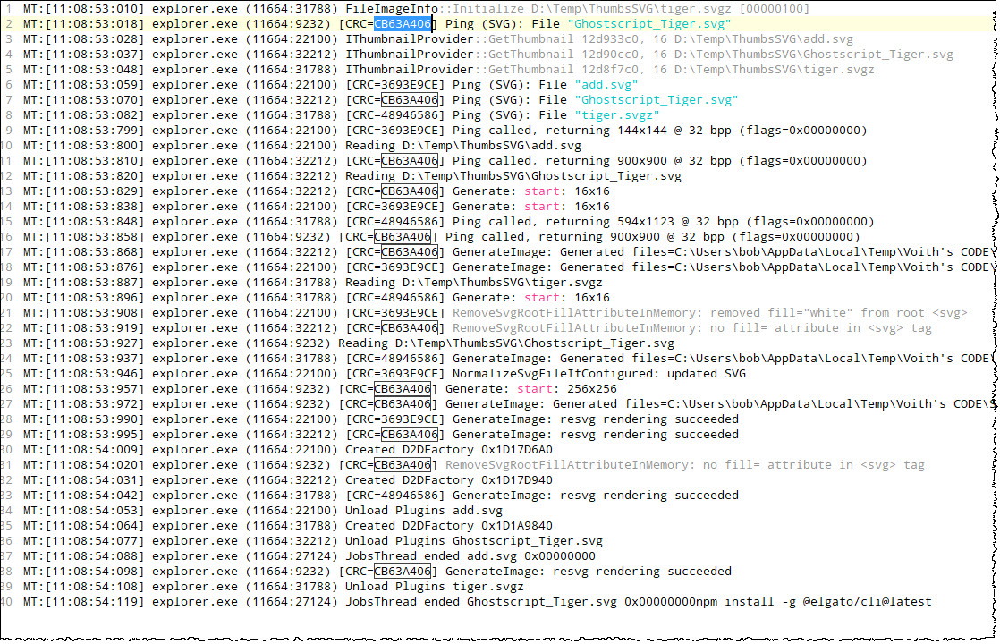

… and even better, below I have searched for the CRC32-code and now you can quickly navigate to any of the referenced lines:

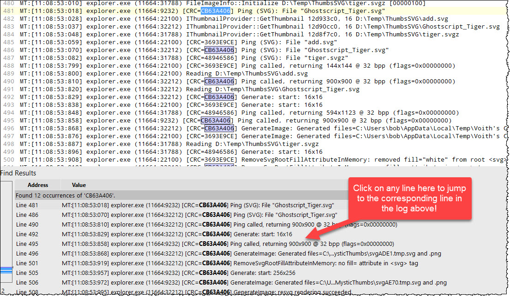

All plugins share:

- CRC32 filename fingerprint.

- Sequence number

- Thread-safe logging

Format example:
```
[ID=8A3F12C4:256#17]
```

Meaning:

- CRC32 of filename

- Desired size

- Invocation counter

This makes debugging Explorer-hosted calls dramatically easier.

# Debugging Plugins

## Essential Debug Flow

* Disable MysticThumbs auto-startup

* Ensure no running MysticThumbs.exe. Use Task Manager to kill MysticThumbs.exe if present.

  Here is a kill-script that can be placed in `kill_mysticthumbs.bat`:

  ```
  @echo off
	echo Killing all MysticNotes processes...
	setlocal

	set PROCESS_LIST=MysticThumbs.exe MysticThumbsControlPanel.exe

	for %%P in (%PROCESS_LIST%) do (
	    echo Terminating %%P ...
	    taskkill /F /IM %%P >nul 2>&1
	    if %ERRORLEVEL%==0 (
    	    echo %%P terminated.
	    ) else (
        	echo %%P not running or already terminated.
    	)
	)

	endlocal
	echo Done.
  ```

* Set Debugging settings like this:

  * Set *Command* to MysticThumbs.exe. Use full path. This launch the Quickview-part of MysticThumbs and thus you can debug the main *Ping* -\> *Generate* sequence within your DLL. You can also use MysticThumbsControlPanel.exe as the debug target, and thus for example debug anything inside the Configuration-dialog. If so don't use a file parameter

  * Ensure *Command Arguments* has a `-p` along the file name in the next step
  
	* Set *Command Arguments* to a file of the desired file type. Remember to use quotes.
	
	
	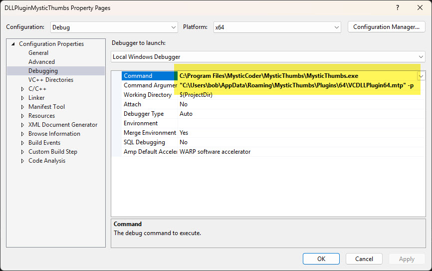
	


* Build directly to:  
  `$(AppData)\MysticThumbs\Plugins\\$(PlatformArchitecture)`

If your plugin has been registered with MysticThumbs, and no `MysticThumbs.exe` run - AND - the specified file in Command Arguments is the correct for the plugin your are developing, then set a breakpoint in Ping() and one in Generate() and step through the code. 

If successful, you should see a Quickview of the specified file!

## If .mtp is Locked

Explorer and many other processes may load (and thus lock) your plugin.

Use LockHunter (https://lockhunter.com) to release the lock.

Note that this is not really recommended, as Explorer or other processes still may hold and lock your DLL via caching etc. This technique should only be used when you are solely focused on debugging your plugin. Regard all other processes and Windows session as unstable after using LockHunter. Remember to reboot the machine before returning to ordinary use of Windows!!

# Build Philosophy

These plugins follow (or should follow(!)) strict principles:

1.  Static Runtime (/MT)
    Avoid CRT mismatches.

2.  No Exceptions Across Boundaries 
    Always return HRESULT.

3.  Defensive Rendering 
    Never trust input dimensions.

4.  Thread Safety 
    Explorer may call concurrently.

5.  No Leaks 
    Explorer stays alive for hours.

# How To Create Your Own MysticThumbs Plugin

1.  Download Example Plugin  
    From: <https://mysticcoder.net/MysticThumbsPlugins/>

2.  Build the project. Note that the 32-bit or 64-bit ExamplePlugin32.mtp or ExamplePlugin64.mtp automatically will build to MysticThumbs plugin directory.

3.  Register the plugin within MysticThumbs. This step is very important in order to being able to both debug- and use the plugin. MysticThumbs won't attempt to load your plugin unless it is registered

4.  Implement IMysticThumbsPlugin 
    Required methods:
    1.  Initialize
    
    2.  Ping
    
    3.  Generate
    
    4.  Shutdown
    
5.  Respect Desired Size 
    MysticThumbs provides:
    1.  params.desiredWidth
    
    2.  params.desiredHeight 
        Use safely.
    
6.  Geenrate should produce 32-bit RGBA 
    Windows expects:
    1.  32-bit
    
    2.  Alpha channel
    
    3.  Correct row stride

Restart Explorer if needed.

# Advanced Tips

## Never allocate unbounded memory

Guard with:

width \* height \* 4

Compare to MaxSvgBytes.

## Never trust file contents

SVG may:

• Reference remote fonts

• Contain massive viewboxes

• Be malformed

Always fail cleanly.

## Use synthetic debug thumbnails

Return bright magenta test bitmap to verify:

• Plugin loaded

• GenerateImage called

• Return path correct
